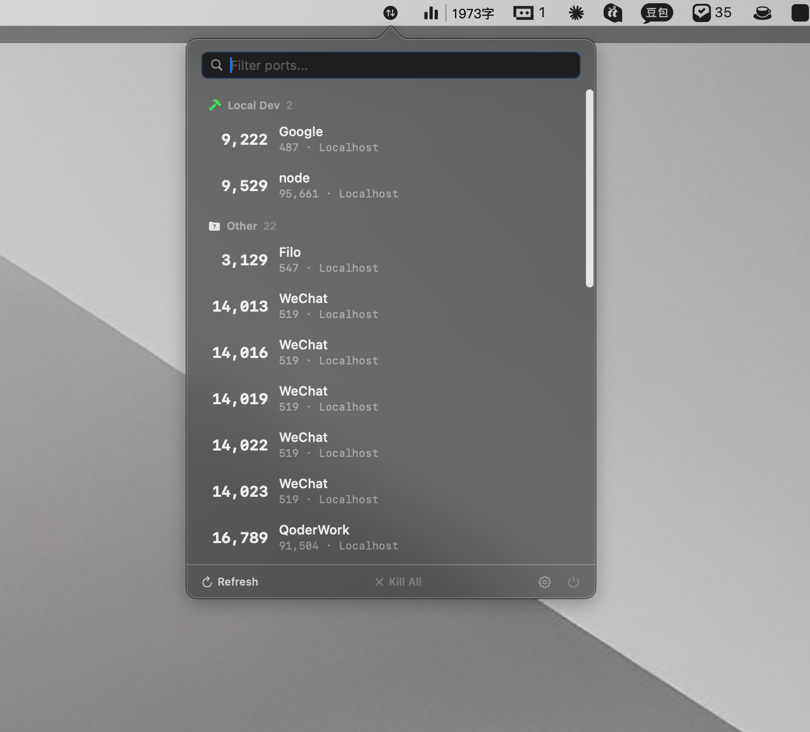

# PortPilot

[English](README.md) | **中文**

一款轻量级 macOS 菜单栏应用，用于管理 TCP 监听端口。监控、搜索、终止进程——一切尽在状态栏中完成。



## 功能特性

- **菜单栏常驻** — 生活在菜单栏中，无 Dock 图标
- **实时端口监控** — 显示所有 TCP LISTEN 端口及其进程名和 PID
- **智能分组** — 自动分类端口：Cloudflare 隧道、K8s 端口转发、Docker、本地开发、系统、其他
- **搜索与过滤** — 即时按端口号、进程名或 PID 筛选
- **进程管理** — 使用 SIGTERM（优雅终止）或 SIGKILL（强制终止）结束进程，超时自动升级
- **快捷操作** — 在浏览器中打开 `localhost:端口`、复制端口号或终止进程
- **键盘快捷键** — `⌘R` 刷新、`⌘K` 全部终止、`⌘,` 设置、`⌘Q` 退出
- **深色与浅色模式** — 自动适配系统外观
- **可配置** — 自定义刷新间隔、端口排除规则、隐藏系统端口
- **通用二进制** — 原生支持 Intel (x86_64) 和 Apple Silicon (arm64)
- **轻量级** — 约 1MB，极低的 CPU 和内存占用

## 系统要求

- macOS 12.0 (Monterey) 或更高版本
- Intel 或 Apple Silicon Mac

## 安装

### 下载安装

从 [Releases](../../releases) 下载最新的 `PortPilot.dmg`，打开后将 `PortPilot.app` 拖入应用程序文件夹。

### 从源码构建

```bash
git clone https://github.com/Ghjsw/PortPilot.git
cd PortPilot
xcodebuild -project PortPilot.xcodeproj -scheme PortPilot \
    -configuration Release \
    ARCHS="arm64 x86_64" \
    ONLY_ACTIVE_ARCH=NO \
    build
```

构建产物位于 `~/Library/Developer/Xcode/DerivedData/PortPilot-*/Build/Products/Release/`。

## 使用方法

1. 启动 PortPilot — 菜单栏将出现 ⇅ 图标
2. 点击图标打开端口列表面板
3. 鼠标悬停在任意端口行上显示操作按钮
4. 右键点击显示包含所有操作的上下文菜单

### 键盘快捷键

| 快捷键  | 操作           |
| ------- | -------------- |
| `⌘R`    | 刷新端口列表   |
| `⌘K`    | 终止所有进程   |
| `⌘,`    | 打开设置       |
| `⌘Q`    | 退出 PortPilot |

### 端口分组

| 分组               | 说明                                              |
| ------------------ | ------------------------------------------------- |
| Cloudflare 隧道    | `cloudflared` 进程                                |
| K8s 端口转发       | `kubectl` 进程                                    |
| Docker             | `docker`、`docker-proxy`、`containerd`            |
| 本地开发           | `node`、`python`、`ruby`、`java`、`nginx` 等      |
| 系统               | 系统进程和知名端口（22、80、443...）              |
| 其他               | 以上未涵盖的进程                                  |

## 配置

### 设置项

- **刷新间隔** — 2秒 / 5秒 / 10秒 / 30秒 / 关闭（仅手动刷新）
- **隐藏系统端口** — 过滤掉操作系统级别的监听端口
- **排除端口** — 以逗号分隔的端口列表（如 `22, 80, 443`）

### 为什么没有 App Sandbox？

PortPilot 需要访问系统进程信息（`lsof`）以及向进程发送信号（`kill()`）的能力。这些操作与 App Sandbox 不兼容，因此本应用通过 Developer ID 签名 + 公证的方式在 Mac App Store 之外分发。

## 项目架构

```
PortPilot/
├── App/              # @main 入口 + AppDelegate (LSUIElement)
├── StatusBar/        # NSStatusItem + NSPopover 控制器
├── Models/           # PortInfo、PortGroup 数据模型
├── Services/         # PortScanner、ProcessKiller、PortGroupClassifier
├── ViewModels/       # PortListViewModel (Combine + async/await)
├── Views/            # SwiftUI 视图（列表、搜索、设置、底栏）
├── Resources/        # Info.plist、Entitlements、Assets
└── Utilities/        # Constants、Extensions
```

**技术栈：** AppKit (NSStatusItem + NSPopover) + SwiftUI | Combine | POSIX 信号 | `lsof`

## 许可证

MIT 许可证。详见 [LICENSE](LICENSE)。
